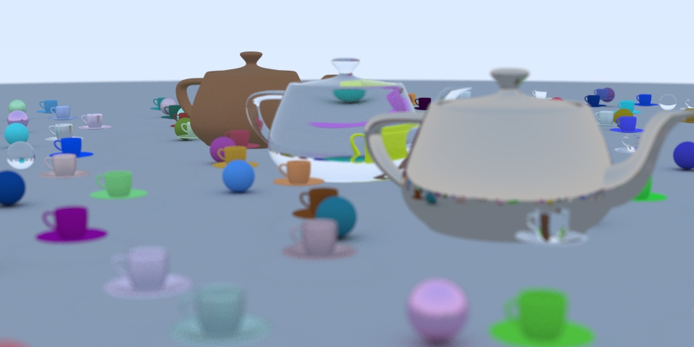

# A Polygon-Free Ray Tracer: Rendering Bicubic Bézier Surfaces in Clojure
Authored by [Andrew Panfilov](https://www.linkedin.com/in/andrewpanfilov/).

# Introduction

This work was partly inspired by a blog post by Alexandre Grison (see [Grison's Blog Post](https://grison.me/2020/04/20/raytraclj-a-raytracer-in-clojure/)), in which he explains how to build a raytracer in Clojure. In March 2020, during the COVID lockdown when I had to spend my vacation at home without the possibility of traveling, I dedicated a week to coding in Clojure. After reading Grison’s post, I recalled my own project on rendering bicubic Bézier splines that I began in 1999 as a high school student and completed in 2003 as a university student. Originally written in C++, the code was later rewritten in Clojure in 2020.

For demonstration purposes, this system employs classic objects from computer graphics such as the Utah Teapot (see [Wikipedia: Utah Teapot](https://en.wikipedia.org/wiki/Utah_teapot)) and teacups. I also used datapoints for the teapot and teacup models from [Ryan Holmes’s website](http://www.holmes3d.net/graphics/roffview/tools/patchoff/), for which I express my gratitude.

I intentionally avoided including Clojure code examples in this article. For readers who are not familiar with Clojure, the detailed code might be challenging. However, those who know Clojure can follow the link to the [GitHub repository](https://github.com/Clojure2D/clojure2d-examples) to read the full source code. Fortunately, Clojure encourages writing very compact code, and the rendering method presented here is both concise and simple to grasp.

This project is primarily educational and was undertaken simply because I enjoy exploring these techniques. This article describes a ray-tracing system implemented in Clojure that renders a scene without using any polygons. Instead, it uses smooth, mathematically defined [Bézier patches](https://en.wikipedia.org/wiki/B%C3%A9zier_surface) combined with spatial data structures to achieve high visual fidelity. The discussion focuses on two main phases: first, the construction of a spatial [quadtree](https://en.wikipedia.org/wiki/Quadtree) for the Bézier patches, and second, the rendering phase in which the system computes the intersection between a ray and a bicubic Bézier surface using iterative refinement via the [Newton-Raphson method](https://en.wikipedia.org/wiki/Newton%E2%80%93Raphson_method).

---

## Result of the Rendering

Rendering this image on my MacBook took almost 95 hours — roughly four days.

---

## Overview of the Rendering Pipeline

For this project, I forked the [Clojure2D-examples repository](https://github.com/Clojure2D/clojure2d-examples/tree/master/src/rt_in_weekend) (I would like to express my sincere gratitude to the authors for making such a valuable resource available). Since the original engine only rendered spheres, I enhanced it by adding support for objects made of bicubic Bézier splines. I kept only one file—`ch12_random_scene.clojure`; this file manages the entire rendering pipeline, which includes:

- **Scene Setup Without Polygons:**  
  The scene is built entirely from curved surfaces defined by Bézier patches—no polygon meshes are used. This eliminates the faceting that typically appears in polygonal models, resulting in perfectly smooth surfaces even when viewed up close.

- **Randomized Object Composition:**  
  The scene is assembled with a large ground sphere, teapots, teacups, and many smaller spheres. Each object is assigned a material (such as Lambertian, metallic, or dielectric) that determines how rays scatter when they hit it.

- **Camera and Ray Generation:**  
  A configurable, positionable camera with depth-of-field effects casts rays through the scene. A recursive function calculates the color for each pixel based on the light interactions along these rays.

- **Parallel Processing:**  
  The rendering process distributes the heavy computation of tracing millions of rays across multiple CPU cores using a thread pool.

- **Final Image Output:**  
  The computed pixel data is collected and saved as an image, resulting in a rich, visually appealing render composed entirely of mathematically defined, smooth surfaces.

---

## Detailed Explanation of Spatial Quadtree Building

The spatial acceleration structure is built specifically for Bézier patches. I use a quadtree that recursively subdivides a Bézier patch into smaller regions, each represented by a bounding sphere. This approach reduces the number of detailed intersection tests during rendering.

### Normalization and Tree Construction

Before subdivision, the control points that define a Bézier patch are normalized relative to a computed center and radius. Each control point is translated (by subtracting the center) and scaled (by dividing by the radius). This step simplifies subsequent calculations and improves numerical stability.

### Recursive Subdivision and Bounding Sphere Aggregation

The tree-building process follows these steps:

- **Subdivision:**  
  At each recursion level, I divide the Bézier patch into four quadrants. When the maximum depth (specified by a parameter such as `levels-number`) is reached, I compute a bounding sphere for that quadrant. The sphere's center is calculated as the average of the four control points defining the quadrant, and the radius is determined as the maximum distance from this center to any of the points.

- **Aggregation:**  
  For nodes that are not at the deepest level, the algorithm recursively builds child nodes for each quadrant. Once the children are created, their individual bounding spheres are merged into a single bounding sphere for the parent node. This aggregated sphere ensures that the parent fully encloses the spatial extent of its children.

- **Traversal and Sampling:**  
  After constructing the quadtree, I traverse the structure (using a function like `tree-seq`) to extract all the leaf nodes—the smallest subdivisions that contain detailed surface information. I then randomize these candidate nodes and select a fixed number for further intersection testing. This random sampling reduces the computational load while still capturing enough detail for accurate intersections.

---

## Detailed Method of Bézier Surface and Ray Intersection

The intersection process between a ray and a Bézier surface involves two main stages: an initial estimation using the spatial quadtree and an iterative refinement using the Newton-Raphson method.

### Initial Intersection Estimation

- **Quadtree Filtering:**  
  The spatial quadtree quickly discards regions of the Bézier patch that the ray does not intersect. Only the leaf nodes, which represent the finest subdivisions, are considered.

- **Surface Evaluation:**  
  In each candidate region, I evaluate the Bézier surface at a pair of parameters \( u \) and \( v \) (ranging from 0 to 1) using Bernstein polynomial functions. This evaluation produces an approximate point on the surface corresponding to the current guess for the intersection.

### Newton-Raphson Iterative Refinement

Once an approximate intersection is obtained, I refine it using the Newton-Raphson method:

- **Error Calculation:**  
  I compute the error as the difference between the evaluated surface point and the corresponding point on the ray (determined by the current guess for the ray parameter \( t \)). This error vector indicates how far the current guess is from a true intersection.

- **Derivative Computation:**  
  Next, I calculate the partial derivatives of the Bézier surface with respect to \( u \) and \( v \). These derivatives provide the tangent directions on the surface, which are essential for understanding how small changes in \( u \) and \( v \) affect the surface point.

- **Parameter Update:**  
  I then compute correction terms for \( u \), \( v \), and \( t \) based on the error and the derivatives. These corrections are applied iteratively to update the parameters, gradually moving the estimated intersection point closer to the actual intersection. The process repeats until the error falls below a predefined threshold or the maximum number of iterations is reached.

- **Boundary Conditions:**  
  Throughout the refinement, I ensure that \( u \) and \( v \) remain within the interval [0, 1] and that \( t \) stays within acceptable limits, thereby guaranteeing a valid intersection on the Bézier surface.

By combining the coarse filtering of the quadtree with the fine-tuning of the Newton-Raphson method, the system efficiently computes precise intersections between rays and bicubic Bézier surfaces.

---

## The Uniqueness of a Polygon-Free Scene

This ray-tracing system is unique because it renders an entire scene with **zero polygons**—achieving mathematical precision with continuous Bézier patches, ensuring data efficiency through compact representations, and delivering superior visual fidelity with perfectly smooth curves and no edge seams or shading discontinuities.

---

## Future Works and Alternative Intersection Methods

While the current implementation uses the Newton-Raphson method for refining ray-surface intersections, alternative methods—such as Broyden's, the Secant, Halley's, Gauss-Newton, and Levenberg-Marquardt methods—could be explored as potential replacements that might be more suitable and efficient in this context. Additionally, the presented solution could potentially be transformed into a series of matrix operations that would parallelize well on GPU architectures, opening up the possibility for real-time ray tracing with the same mathematical precision and visual fidelity.

---

## Conclusion

This Clojure-based ray-tracing system demonstrates advanced graphics programming by rendering a scene with zero polygons using smooth Bézier patches. The process is divided into two main phases: first, the construction of a spatial quadtree that recursively subdivides a Bézier patch into smaller regions (each represented by a bounding sphere) to quickly eliminate regions that a ray does not intersect; and second, the rendering phase, where the system computes the intersection between a ray and a bicubic Bézier surface using an initial estimation followed by iterative refinement via the Newton-Raphson method. Together, these techniques enable high-precision intersection tests while maintaining efficiency.

The combination of these approaches results in an efficient and accurate ray tracer, paving the way for further innovations in rendering technology.
